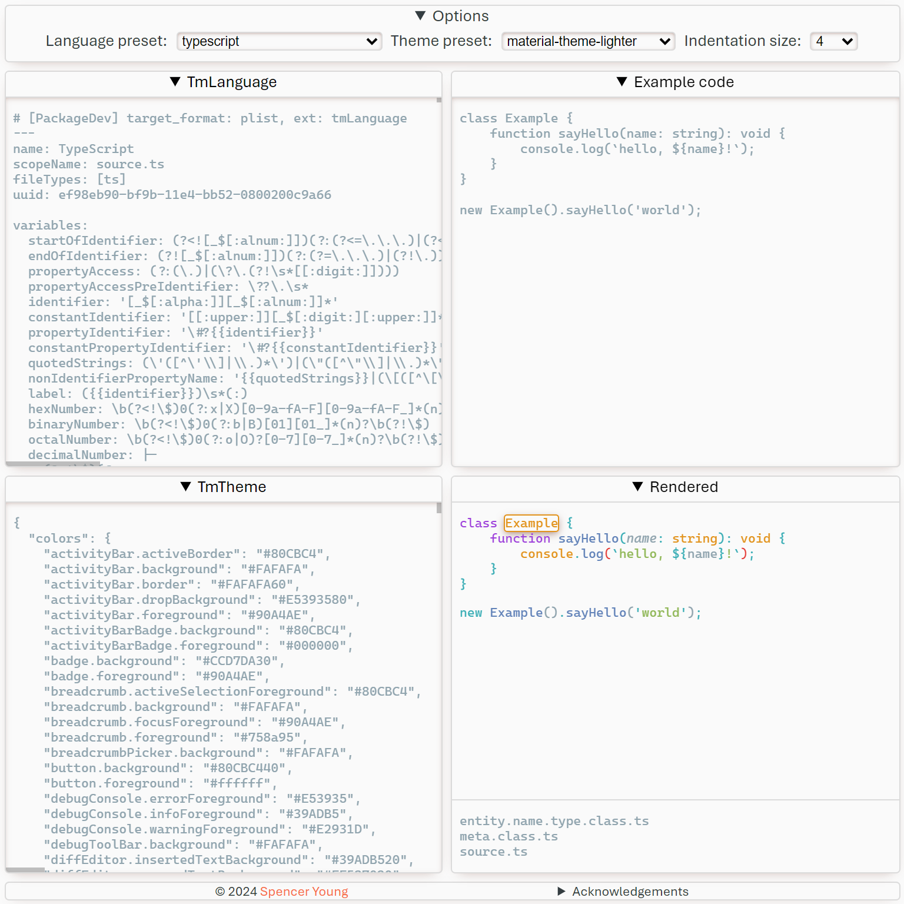

## Overview

This is a simple single-page application for experimenting with TmTheme and TmLanguage definitions for editors like Sublime or VSCode.

<picture style="width: fit-content">
  <source media="(prefers-color-scheme: dark)" srcset="./screenshot-dark.png">
  <source media="(prefers-color-scheme: light)" srcset="./screnshot.png">
  
</picture>

## Usage

### Input

#### TmLanguage

This text box accepts a [TmLanguage](https://macromates.com/manual/en/language_grammars) in YAML, JSON, or XML plist format.

#### TmTheme

This text box accepts a [TmTheme](https://www.sublimetext.com/docs/color_schemes_tmtheme.html)
or [VSCode color theme](https://code.visualstudio.com/api/extension-guides/color-theme#create-a-new-color-theme) in YAML, JSON, or XML plist format.

#### Example code

This text box accepts any text that can be parsed with the provided TmLanguage.

### Output

This view shows how the 'Example code' text is displayed when parsed by the provided TmLanguage and highlighted with the provided TmTheme.
Select any rendered token in this view to see which scopes are applied to it by the TmLanguage.

#### Rendered

## Acknowledgements

- [shiki](https://shiki.style/) for parsing and highlighting code
- [shikijs/textmate-grammars-themes](https://github.com/shikijs/textmate-grammars-themes) for built-in language and theme presets
- The official [TypeScript TmLanguage](https://github.com/microsoft/TypeScript-TmLanguage) for an example of a more complex YAML grammar
